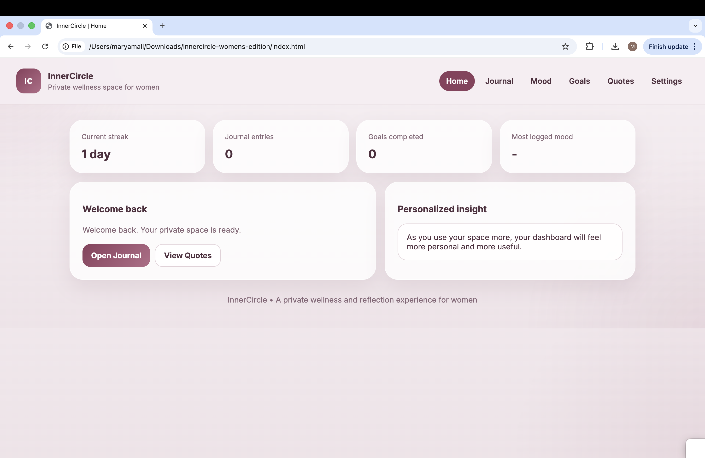
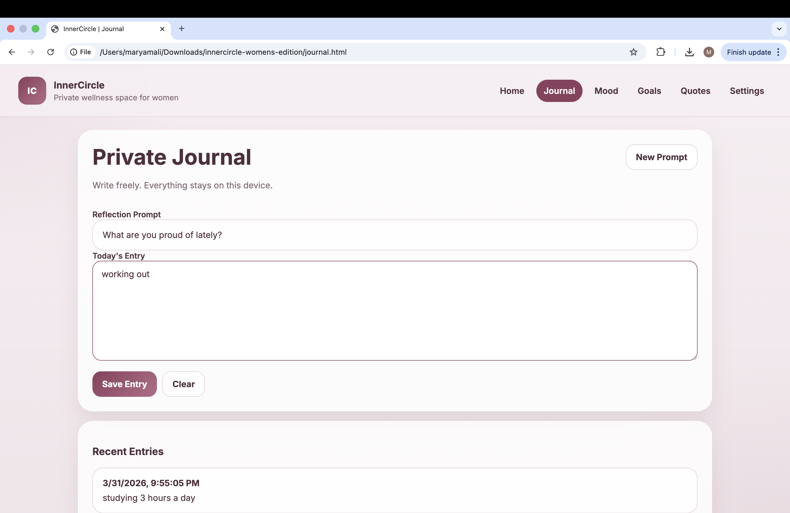
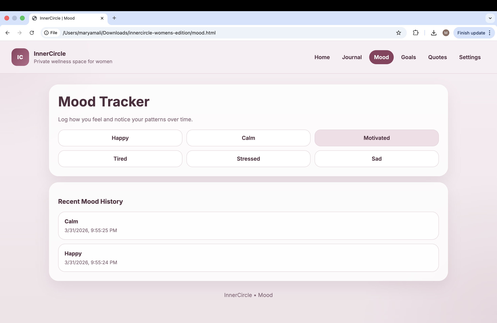
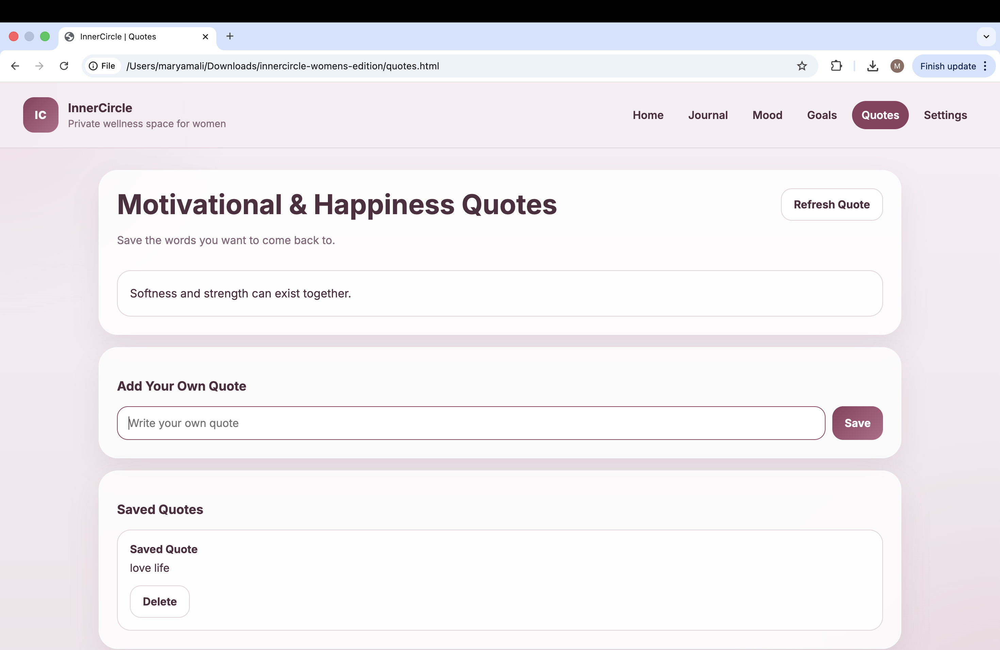
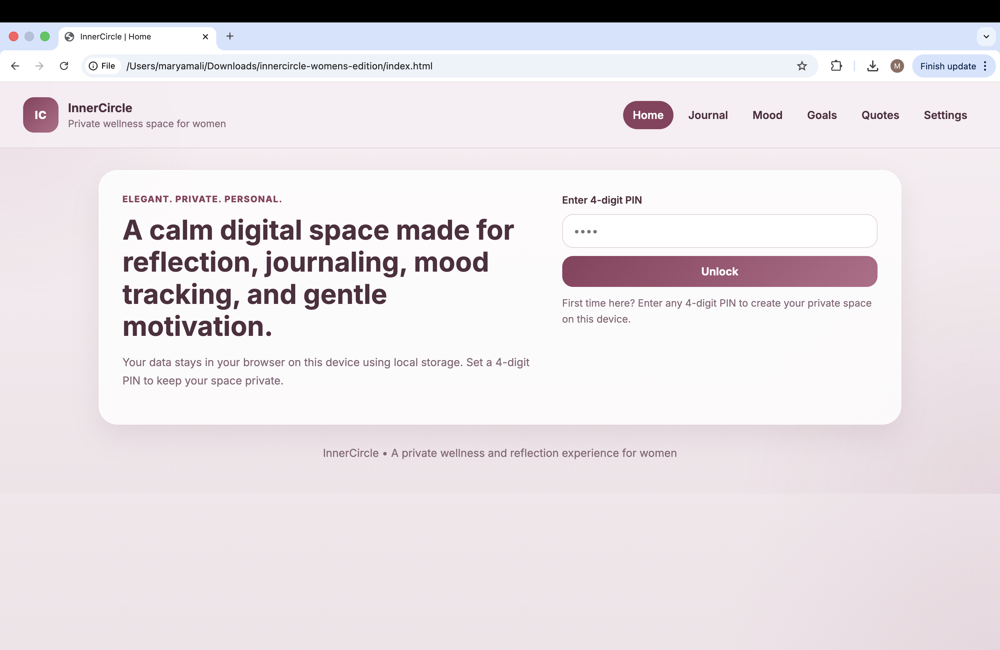

# InnerCircle — Private Wellness Web App (HTML, CSS, JavaScript)

A multi-page wellness web application designed for journaling, mood tracking, and personal reflection. Built using HTML, CSS, and JavaScript with a focus on user experience, privacy, and clean UI design.

## Highlights
- Multi-page frontend application with structured navigation  
- Client-side data persistence using localStorage  
- Designed a user-focused interface for journaling and mood tracking  
- Implemented private PIN-based access system  

## Demo
Click below to watch the demo:

## Features
- PIN-based private access  
- Multi-page navigation  
- Private journaling system  
- Mood tracking with history  
- Goals and habit tracking  
- Motivational and happiness quotes  
- Custom quote saving  
- Settings and personalization  
- Local data storage using localStorage  

## Tech Stack
- HTML (structure)  
- CSS (UI design and layout)  
- JavaScript (logic and interactivity)  
- localStorage (client-side data persistence)  

## Concept
InnerCircle is designed as a calm, private digital space for women. The focus is on emotional awareness, personal growth, and creating a safe environment for reflection.

## Data Handling
All data is stored locally in the browser using `localStorage`, meaning journal entries, moods, goals, and quotes remain private to the user’s device.

## Challenges & Solutions
- Designed a private data system using localStorage instead of backend storage  
- Structured a multi-page application without frameworks  
- Balanced UI design with usability for a personal wellness product  

## Key Learning
- Built and structured a multi-page frontend application  
- Managed state using localStorage  
- Focused on user experience and clean UI design  
- Designed a product-style interface  

## Future Improvements
- User authentication system  
- Cloud-based storage  
- Mobile app version  
- Notifications and reminders  

## Preview

### Home

### Journal

### Mood Tracker

### Quotes

### Lock Screen

